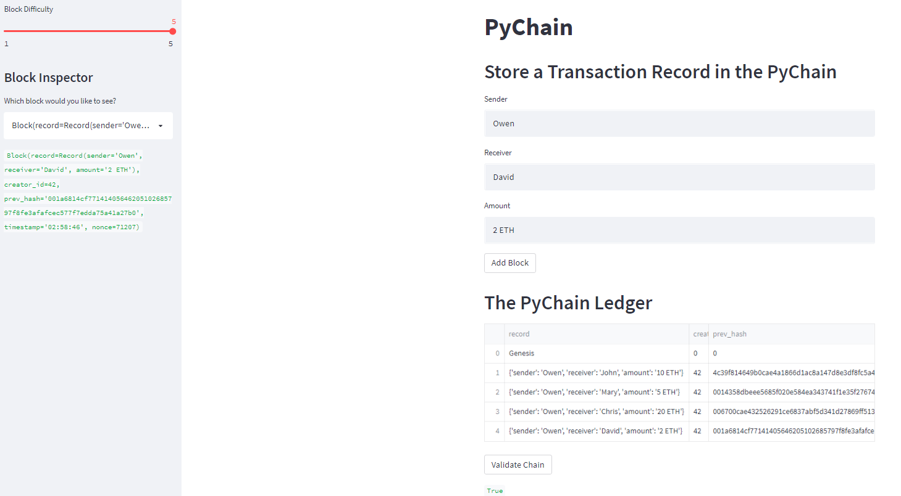

# Pychain_Ledger

For this project my task was to build a blockchain-based ledger system, complete with a user-friendly web interface. This ledger allows partner banks to conduct financial transactions (that is, to transfer money between senders and receivers) and to verify the integrity of the data in the ledger.

## Technologies Required

Running the python file requires the installation of Streamlit, Pandas and Hashlib. 

In the terminal, navigate to the project folder and run the Streamlit application by using `streamlit run pychain.py`.

## Results

Here is a screenshot demonstrating a blockchain consisting of multiple bocks. The validation process confirms the validity as True. 

## Contributors

Owen Harris